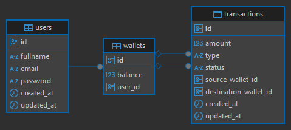

# Carteira Digital - API

<div styles="text-align: center;">
  
  
  
  
  
  
  
  
</div>
</br>

- [Arquitura](#estrutura-do-projeto)
  - [Modelagem do banco de dados](#modelagem-do-banco-de-dados)
  - [ORM](#orm)
  - [Locking de dados e concorrência](#locking-de-dados-e-concorrência)
  - [Testes](#testes)
  - [Estrutura de pastas](#estrutura-de-pastas)

</br>

- [Executando o projeto](#como-rodar-o-projeto)
  - [Pré-requisitos](#pré-requisitos)
  - [Rodando a aplicação](#rodando)
  - [Documentação da API (Swagger)](#swagger)

## Estrutura do projeto

O projeto está organizado e separado em módulos, cada um com suas responsabilidades bem definidas. Segui um padrão de DDD para organizar cada domínio, mesmo que não 100% explícito, e dentro de cada domínio, separei as responsabilidades em camadas como DTOs, entidades, repositórios e casos de uso.

### Modelagem do banco de dados

A estrutura das entidades é bem simples, com três entidades principais: `User`, `Wallet` e `Transaction`.

Uma `User` pode ter várias `Wallets`, e cada `Wallet` pode ter várias `Transactions`. As transações podem ser de depósito, transferência ou reversão (Estorno).



### ORM

O projeto utiliza o TypeORM como ORM para interagir com o banco de dados. Mas está abstraído em repositórios, então você pode trocar o ORM facilmente se necessário.

Realizações de transações também foi abstraída, onde podemos executar a lógica dentro do handler de forma simples, cobrindo casos de sucessos e erros.

### Locking de dados e concorrência

Para evitar problemas de concorrência, o projeto implementa um sistema de locking de dados, em toda transação que envolve saldo de carteiras. Isso garante que duas transações não possam modificar o mesmo saldo ao mesmo tempo, evitando inconsistências dos valores.

### Testes

O projeto possui testes unitários para garantir o funcionamento correto de cada módulo. Os testes estão localizados dentro de cada módulo.

### Estrutura de pastas

<details>
<summary>Veja a estrutura de pastas do projeto</summary>

```📂 src
├── 📂 application
│   ├── 📂 transactions
│   │   ├── 📂 dtos
│   │   ├── 📂 entities
│   │   ├── 📂 repositories
│   │   ├── 📂 use-cases
│   │       ├── 📂 deposit-in-wallet
│   │       ├── 📂 list-transfers
│   │       ├── 📂 revert-transaction
│   │       ├── 📂 transfer-to-wallet
│   ├── 📂 users
│   │   ├── 📂 dtos
│   │   ├── 📂 entities
│   │   ├── 📂 repositories
│   │   ├── 📂 use-cases
│   │       ├── 📂 authenticate-user
│   │       ├── 📂 create-user
│   ├── 📂 wallets
│   │   ├── 📂 dtos
│   │   ├── 📂 entities
│   │   ├── 📂 repositories
│   │   ├── 📂 use-cases
│   │       ├── 📂 check-wallet-balance
│   │       ├── 📂 find-user-wallet
│   │       ├── 📂 reallocate-wallet-balances
├── 📂 common
│   ├── 📂 decorators
│   ├── 📂 providers
│   │   ├── 📂 hash
│   │       ├── 📂 types
├── 📂 infra
│   ├── 📂 auth
│   │   ├── 📂 guards
│   │   ├── 📂 strategies
│   │   ├── 📂 types
│   ├── 📂 database
│   │   ├── 📂 typeorm
│   │   │   ├── 📂 mappers
│   │   │   ├── 📂 migrations
│   │   │   ├── 📂 repositories
│   │   │       ├── 📂 transactions
│   │   │       ├── 📂 users
│   │   │       ├── 📂 wallets
│   ├── 📂 http
│   │   ├── 📂 controllers
│   │       ├── 📂 auth
│   │       ├── 📂 transfers
│   │       ├── 📂 wallets

```

</details>

---

## Como rodar o projeto

<div styles="text-align: center;">
  
  
</div>
</br>

Vamos ser diretos e rodar direto no Docker, que é a forma mais simples de rodar o projeto.

### Pré-requisitos

Devemos ter um arquivo `.env` na raiz, então apenas copie o arquivo `.env.example` para `.env`, não é necessário alterar nada, pois já está configurado para rodar no Docker de forma simples.

### Rodando

Para rodar, basta executar o seguinte comando:

```bash
docker compose up -d
```

Isso irá iniciar os containers do banco de dados e da aplicação. A aplicação estará disponível em `http://localhost:5000`.

## Swagger

<div styles="text-align: center;">
  

</div>
</br>

Para acessar a documentação da API, você pode acessar o Swagger em `http://localhost:5000/api-docs`.

ou [clique aqui](http://localhost:5000/api-docs).
